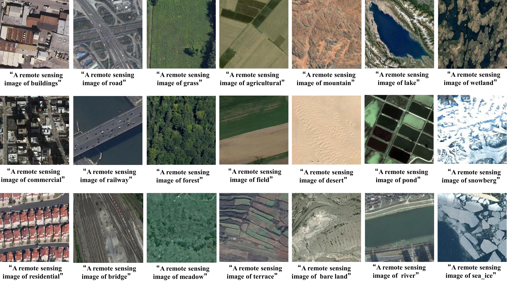

# RS-VFMs-Fine-tuning-Dataset
The VFMs are pre-trained on large-scale image datasets and have proven to be highly effective in a variety of visual tasks, including object detection, segmentation, and classification. However, their application in specialized fields like RS often requires further adaptation. RSIs present unique challenges due to their high variability in scale, resolution, and scene complexity. These characteristics differ significantly from the data typically used to train VFMs, making direct application less effective. Therefore, adapting VFMs to better handle the distinct features of RSIs is crucial for improving their performance in RS applications.

This dataset is specifically designed for fine-tuning the VFMs. The dataset contains 42,000 images with varying dimensions (256×256, 200×200, and 400×400 pixels) and resolutions ranging from 0.3 meters to 2 meters. It covers 70 common land cover classes in RS. Each image was annotated with a corresponding textual description to create the RS VFMs Fine-tuning Dataset. This dataset encompasses 70 common land cover classes, such as farmland, cloud, residential, desert, forest, freeway, harbor, industrial area, island, mountain, railway, and river. 

## Dataset Details
- **Total Images**: 42,000
- **Image Dimensions**: 256x256, 200x200, 400x400 pixels
- **Resolution**: Ranges from 0.3 meters to 2 meters
- **Land Cover Classes**: 70 classes (e.g., farmland, cloud, residential, desert, forest, freeway, harbor, industrial area, etc.)
- **Annotations**: Each image is annotated with a textual description.

## Download Links

- **Baidu Cloud**: [Download Link](https://pan.baidu.com/s/1tYTlTREkacDrLtz7xAVfyQ?pwd=m754)  
  **Extraction Code**: m754
- **Google Cloud**: [Download Link](https://drive.google.com/drive/folders/1NIWWXbO6QcDpMsFSy7GLdmq3HeYOnjM-?usp=drive_link)

## Citation

If you use this dataset in any academic work or research, please cite the following paper:
- Jiang W, Sun Y, Lei L, et al. *AdaptVFMs-RSCD: Advancing Remote Sensing Change Detection from binary to semantic with SAM and CLIP* [J]. ISPRS Journal of Photogrammetry and Remote Sensing, 2025, 230: 304-17.

## Example Images
Below are some example images from the dataset:

